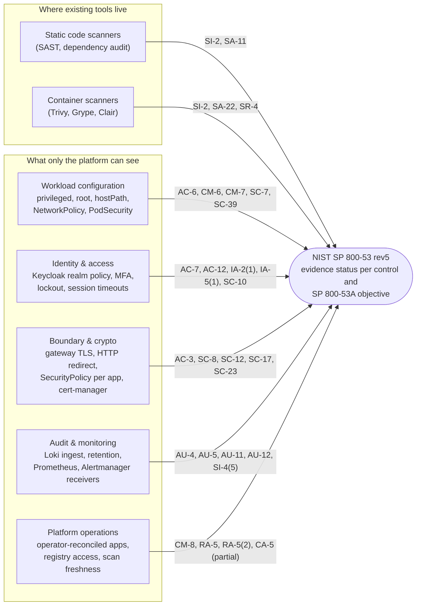
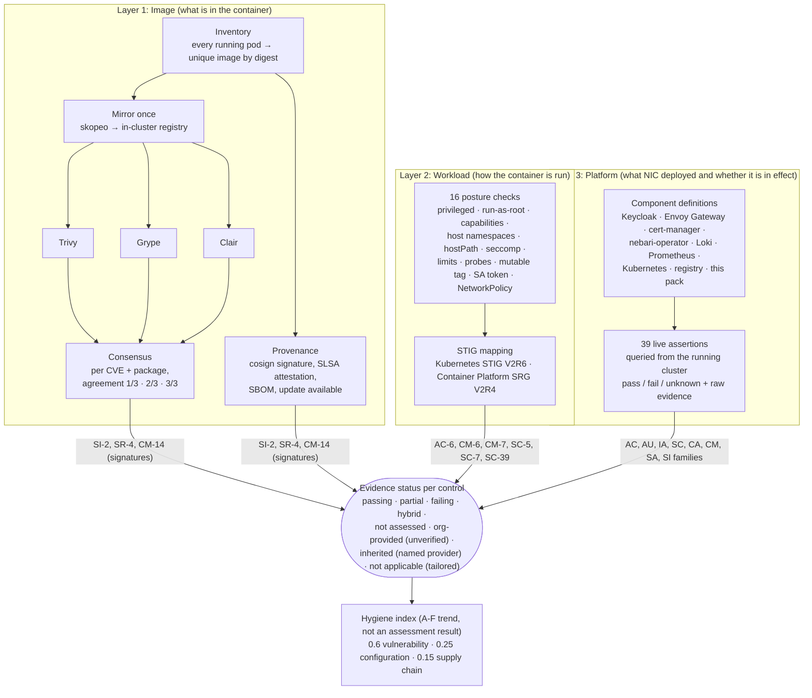
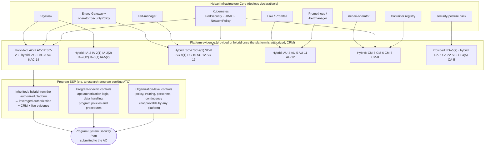
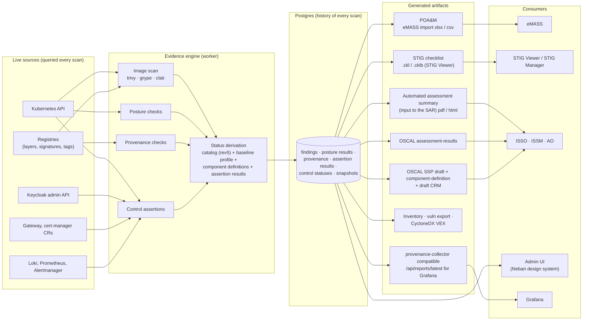
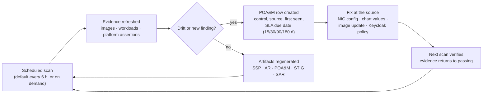

# Architecture: from container scans to an 800-53 control picture

This page is the 30,000-foot view of how the pack turns what Nebari deploys into
continuous ATO evidence. It is written for people deciding whether to adopt the
model, not for people operating it. Operating docs: [CONTROLS.md](CONTROLS.md),
[REPORTS.md](REPORTS.md), [PROVENANCE.md](PROVENANCE.md), [SCORING.md](SCORING.md).

## 1. The core idea: ownership beats scanning

A vulnerability scanner looks at an artifact and can only report defects. It can
say "SI-2: here are CVEs". It cannot see how identity, the gateway or logging are
configured, because it does not own them. (No tool says a control is satisfied;
an assessor does.)

Nebari Infrastructure Core (NIC) deploys the whole platform declaratively:
Keycloak, Envoy Gateway, cert-manager, logging, the nebari-operator, and every
software pack. So for a large set of controls the platform knows two things no
scanner can:

1. **What the intended implementation is**, because NIC wrote it.
2. **Whether it is actually in effect right now**, because the pack can query it.

Put those together and the platform can serve as an **evidence source for a
common control provider**. Inheritance itself requires more than evidence: the
platform's controls must be assessed and authorized (its own SSP, SAR and ATO,
for example as a common control provider in eMASS) and documented in a Customer
Responsibility Matrix (CRM) that says, per control, what is provided, what is
shared and what stays with each program. The pack produces the evidence and a
draft CRM (`GET /compliance/crm`, report `crm`); it does not make anything
inheritable on its own.

## 2. Three evidence layers, one control picture

The pack collects evidence at three altitudes. Each layer answers different
control families; together they contribute automated evidence to about 52 of the
287 MODERATE controls (39 assertions plus scan and posture results). Most of those
are partial or hybrid: the platform evidences some SP 800-53A objectives and the
program owns the rest.

## 3. Control inheritance: what it takes

This is the part that can change the economics of an ATO, and the part most
easily overstated. A program's SSP must answer every control. Many technical
answers describe the platform the program runs on. A program can *inherit* them
only from a platform that has been assessed and authorized as a common control
provider, with a CRM; a machine-generated SSP refreshed every scan does not
substitute for that (the AO authorizes a state plus a ConMon strategy, not a
live feed). What the pack gives that model: continuous evidence for the
platform-provided and hybrid controls, and a draft CRM. A realistic ceiling at
MODERATE is roughly 15-30 controls fully provided by a platform like this and
60-90 hybrid; policy, personnel and most process controls never come from the
platform.

Honest boundaries of the model:

- **Organizational controls** (roughly two thirds of the catalog) are policies,
  training, personnel and contingency planning. The engine reports them as
  *not assessed*, or, with `controlsEngine.inheritOrganizationalControls=true`,
  as *organization-provided (unverified)*, which never counts as implemented.
  A control is *inherited* only when a named, authorized common control
  provider is configured for it (`controlsEngine.commonControlProviders`).
- **Some technical controls are invisible from inside the cluster.** API-server
  audit logging on MicroK8s returns *unknown* for exactly that reason. More is
  visible on NIC-provisioned cloud clusters, but never everything.
- **Organization-defined parameters** (lockout threshold, idle timeout, password
  length, log retention) come from the selected profile's cited ODP set (FedRAMP
  Rev5, or DISA SRG / CNSSI 1253 for the DoD approximation) and can be
  overridden in settings. Only the NIST LOW / MODERATE / HIGH and FedRAMP Rev5
  Moderate control lists are exact; DoD programs need their CNSSI 1253 control
  set from eMASS.
- **Assessors accept evidence, not tools.** Every assertion carries its raw
  evidence and timestamp so a human doing a sample-based check can verify it.

## 4. The evidence pipeline: from live cluster to eMASS

## 5. The continuous-ATO loop

Once the evidence is live, the ATO stops being a document and becomes a loop.
Every scan re-derives control status; anything that regresses shows up as drift
with an SLA clock, and most platform-level fixes are one-line NIC configuration
changes that the next scan verifies.

## 6. What this looked like on the first run

The `grace` lab cluster, MODERATE baseline, 2026-10-03 (details in
[CONTROLS.md](CONTROLS.md)): 35 assertions (now 39), 19 pass, 15 fail, 1 unknown. The
platform reported on itself: no Keycloak password policy, no MFA on the admin
account, login and admin events not recorded, 21 of 23 namespaces without a
PodSecurity enforce label, no default-deny NetworkPolicy in any app namespace,
anonymous access to the in-cluster registry. Nobody wrote those findings down.

Most of them are one-line changes in NIC. That points at the next step: ship a
hardened baseline in the operator so a fresh Nebari deployment starts mostly
green, and this pack becomes the drift detector rather than the bearer of bad
news.

## Where the pieces live

| Concern | Code | Doc |
|---|---|---|
| Inventory, mirroring, scanners, consensus, scoring | `api/src/posture/{inventory,mirror,scanners,correlate,scoring}.py` | [SCORING.md](SCORING.md) |
| Posture checks and STIG mapping | `api/src/posture/posture_checks.py`, `reports/data/stig_mapping.yaml` | [REPORTS.md](REPORTS.md) |
| Provenance (signatures, SLSA, SBOM, updates, Helm) | `api/src/posture/provenance/` | [PROVENANCE.md](PROVENANCE.md) |
| Catalog, component definitions, assertions, SSP | `api/src/posture/controls_engine/` | [CONTROLS.md](CONTROLS.md) |
| NIST control tagging | `api/src/posture/reports/data/controls.yaml` | [DESIGN.md §11](DESIGN.md) |
| Report generators | `api/src/posture/reports/` | [REPORTS.md](REPORTS.md) |
| Chart, admin gate, RBAC | `chart/` | [README](../README.md) |
